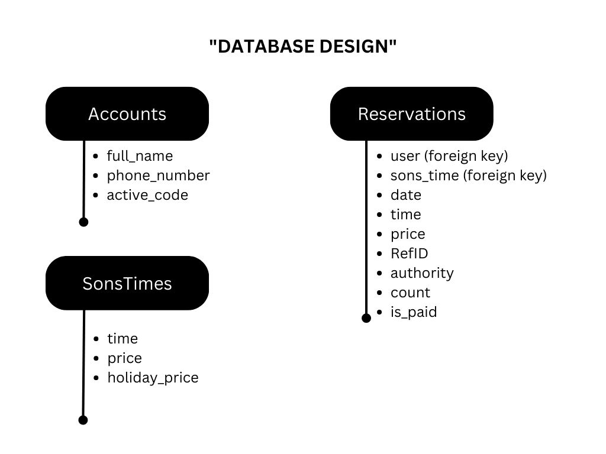

# A Reservation System With Django + PostreSQL


## Database Design :


## How to run project :

1. Create virtual environment:

```bash
    python -m venv myvenv
    source myvenv/bin/activate
```

2. Install packages:

```bash
    pip install -r requirements.txt
```

3. Create Migrations and Migrate Database:

```bash
    python manage.py makemigrations accounts
    python manage.py makemigrations reservations
```

```bash
    python manage.py migrate
```

4. Create superuser:

```bash
    python manage.py createsuperuser
```

5. Add seed data:

```bash
    python manage.py seeder
```

6. Run local server:

```bash
    python manage.py runserver
```
